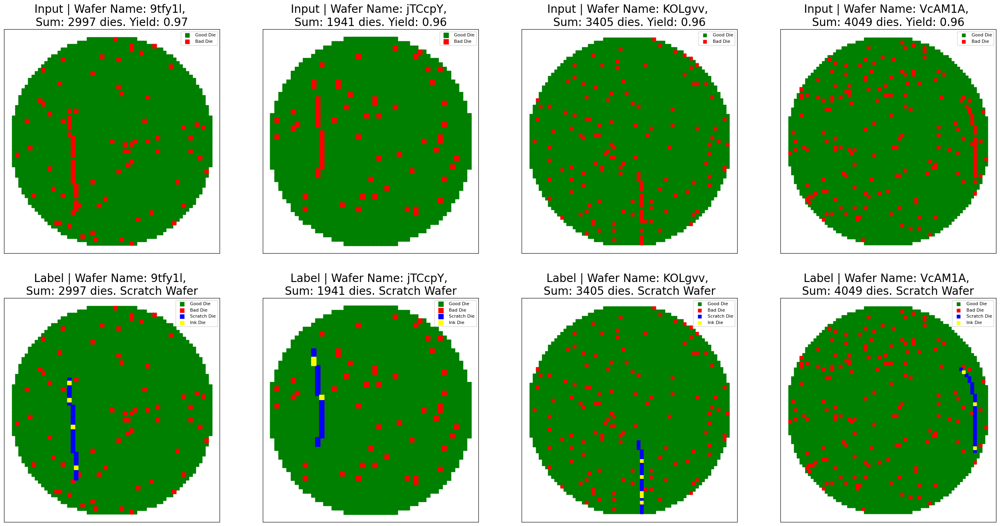
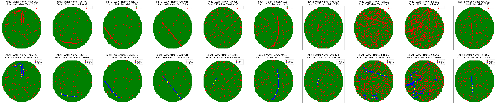

# Wafer Scratch Detection with Attention U‑Net 🩻🛠️

Automated segmentation of line‑shaped defects (scratches) on semiconductor wafer maps using a compact **Attention U‑Net** implemented end‑to‑end inside a single Jupyter notebook.

---

## 1 · Problem Statement

Integrated‑circuit (IC) wafers contain thousands of dies laid out on a rectangular grid.  **Scratches**—thin, line‑like defects caused by mishandling or tool contact—often cut across many dies and devastate yield.

\* Goal → detect every pixel belonging to a scratch so that process engineers can trace root causes and quarantine bad wafers.
\* Input → a table listing die positions and a Boolean flag (`IsGoodDie`) per die.
\* Output → dense binary mask (1 = scratch pixel) **and** the extracted list of defect coordinates.

---


<p align="center">
  
</p>

## 2 · Data Description

Raw inspection data arrive as CSV rows:

```text
WaferName,DieX,DieY,IsGoodDie
WAFER_001,12,23,True
WAFER_001,13,23,False
⋮
```

### From CSV to Model Tensor

1. **Rasterise** the wafer grid → a 70 × 70 image where pixel = die.
2. **Add an edge channel** by passing the raster through Sobel filters.
3. **Stack channels** → 2 × 70 × 70 tensor (map + edges).


---

## 3 · Model Architecture

We employ a **three‑level encoder–decoder U‑Net enhanced with attention gates** that suppress irrelevant skip‑connections and highlight scratch‑specific features.

```python
class AttentionUNet(nn.Module):
    def __init__(self, in_channels=2, out_channels=1):
        …  # see notebook for full code
```

### Layer‑wise Diagram

```
Encoder
  ├─ ConvBlock 2→64   → skip‑1
  ├─ MaxPool2d
  ├─ ConvBlock 64→128 → skip‑2
  ├─ MaxPool2d
  └─ ConvBlock 128→256  ← bottleneck

Decoder
  ├─ AttentionGate(256,128,64) + UpBlock(256+128→128)
  └─ AttentionGate(128, 64,32) + UpBlock(128+64 → 64)

Head
  └─ Conv2d 64→1  → Sigmoid → Scratch mask
```

* **Loss** = ½ BCE 
* **Metrics** = Dice, IoU, pixel accuracy

---

## 4 · Solution Pipeline

1. **Pre‑processing** – build two‑channel tensors, split train/val.
2. **Training** – run 30 epochs, AdamW optimiser (1 e‑3 → 1 e‑4 cosine anneal).
3. **Inference** – generate scratch mask, threshold at 0.5.
4. **Post‑processing** –

   * skeletonise mask to extract centre‑line (optional),
   * label connected components → list of scratch coordinates.
5. **Visual QC** – overlay prediction on wafer for engineer review.

---

## model resoult
<p align="center">
  
</p>


